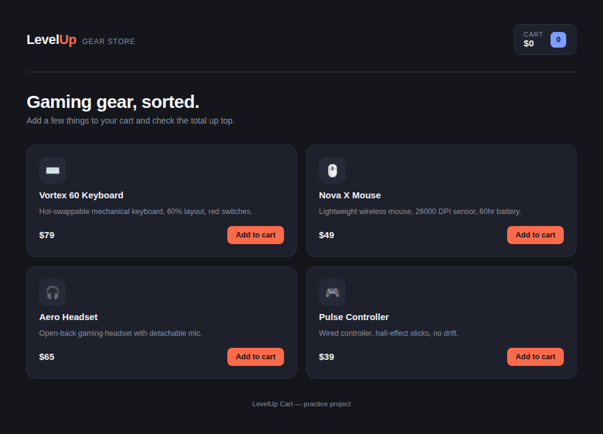
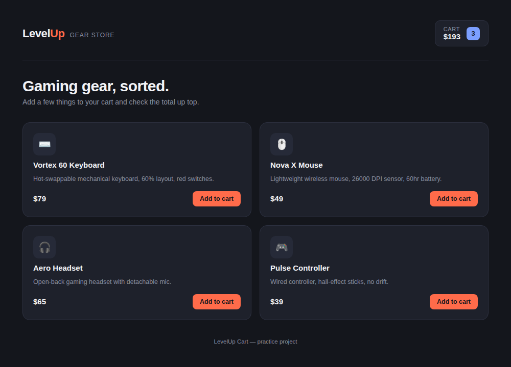

# LevelUp Cart — Before & After: React Bug Fix

A tiny gaming-gear shop built in React, with a real bug I broke on purpose, found, and fixed — to show the debugging process, not just claim it.

## The bug

Clicking "Add to cart" didn't do anything visible. The cart badge stayed at **0 items / $0** no matter how many products I added.



**Cause:** in `handleAddToCart`, I was mutating the `cartItems` array directly:

```js
function handleAddToCart(product) {
  cartItems.push(product);   // mutates the existing array
  setCartItems(cartItems);   // same reference in, same reference out
}
```

React compares state by reference, not by value. Since `cartItems` was still pointing at the same array, React assumed nothing changed and skipped the re-render — even though the array itself had new items in it.

## The fix

```js
function handleAddToCart(product) {
  setCartItems((prev) => [...prev, product]); // new array reference
}
```

Spreading into a new array gives React a new reference to compare against, so it re-renders and the badge updates correctly.



## Run it yourself

```bash
npm install
npm run dev
```

Then open the local URL it prints (usually `http://localhost:5173`).

## Files

- `src/App.jsx` — main component (fixed version)
- `src/App.BROKEN.jsx.txt` — the buggy version, kept for reference/comparison
- `src/main.jsx` — entry point
- `src/styles.css` — styling

## Stack

React 19 + Vite
